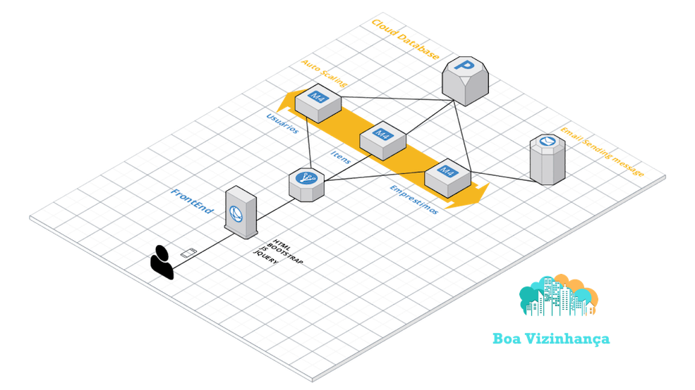

# Hackaton
Project for the hackaton_fiap.

Trabalho para o projeto Hackaton da turma 73AOJ / HACKATHON EXPERIENCE LAB do MBA  Engenheria de Software, FIAP. 

# Backend: 
3 microservices:

* Items
* Emprestimo
* Users

Teconologia Java SpringBoot

# FrontEnd:

* App
Tecnologia HTML, JavaScript

Conexao ao banco de dados MySQL

